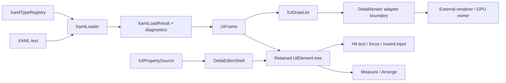
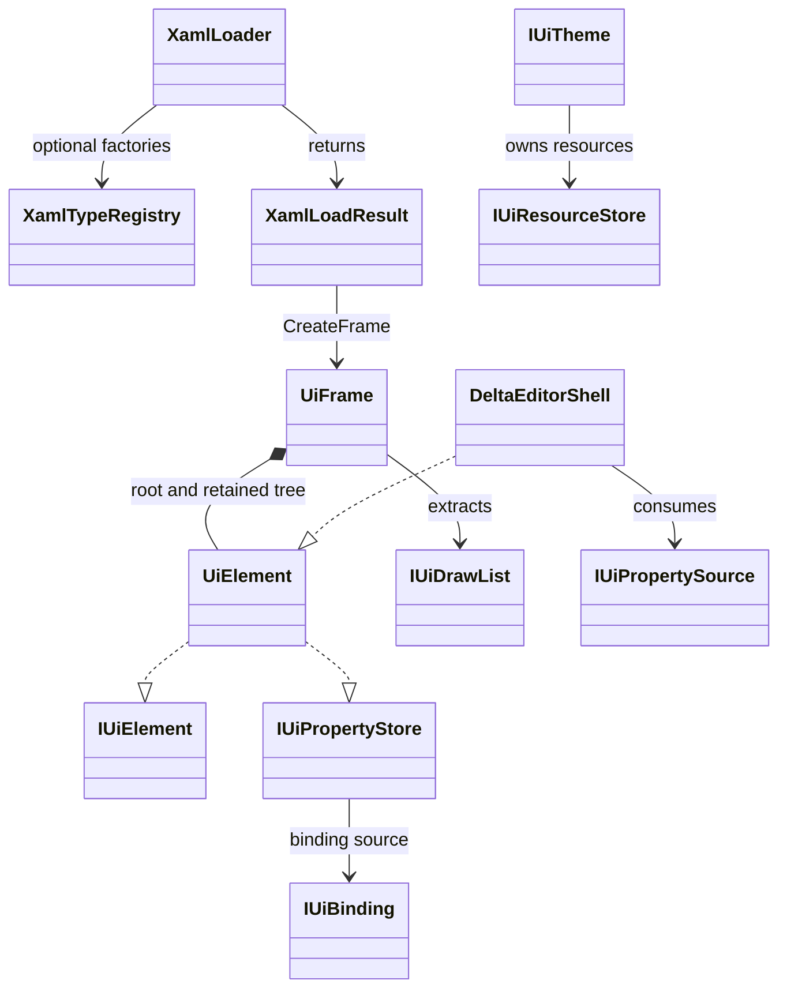

# DeltaXAML architecture and API

This document describes the behavior implemented by the current DeltaXAML
source tree. It is an API and integration map, not a promise of full XAML
compatibility. The runtime API is unchanged by this document.

## Boundary and ownership

DeltaXAML owns the small XAML dialect, parsing diagnostics, the retained
`UiElement` tree, property values and invalidation, controls, layout, hit
testing, routed input, and renderer-neutral draw data.

The renderer boundary is `IUiDrawList`. DeltaXAML produces ordered
`UiDrawCommand` values, clip entries, and `UiTextRun` values. A DeltaRender
adapter may consume those values, but this repository has no dependency on
DeltaRender, DeltaEngine, ECS, SDL, Vulkan, a font atlas, or a shaping
backend. Text shaping and glyph rasterization therefore remain outside this
API.

## Runtime lifecycle

The normal composition path is:

### 1. Parse and load

`XamlLoader.Load(string)` reads XML with DTD processing disabled and comments
ignored. It returns `XamlLoadResult`, which contains a nullable `Root` and an
ordered read-only list of `XamlDiagnostic` records. `Success` is true only
when a root exists and there are no diagnostics.

The built-in element names are `Panel`, `StackPanel`, `Border`, `Grid`,
`ContentControl`, `Button`, `ToggleButton`, `TextBlock`, `TextBox`,
and `ScrollViewer`.
Children are added to `IUiPanel` elements or assigned to a
`ContentControl`. The current loader recognizes these attributes:

`Width`, `Height`, `Fill`, `Background`, `Orientation`, `Text`, `FontKey`,
`FontSize`, `Foreground`, `Padding`, `StyleKey`, `TemplateKey`,
`AutomationName`, `AutomationRole`, `IsEnabled`, and `IsSelected`.

Unknown elements produce `XAML002`; unknown properties produce `XAML003`.
Malformed XML produces `XAML001`. The loader does not use reflection or
assembly scanning to resolve types.

`XamlLoader.LoadFrame(string)` is the composition-friendly convenience path.
It loads the result, calls `CreateFrame()` only for a successful result, and
applies `DeltaTheme.Default` to the resulting frame root. Callers that need
custom handling can use `Load`, inspect diagnostics, and call
`XamlLoadResult.CreateFrame()` explicitly; neither path constructs a fallback
tree after a failed load.

### 2. Type registry and custom elements

`XamlTypeRegistry.Register(string, Func<UiElement>)` adds a factory for an
element name. After the built-in switch, the loader asks the registry for an
unrecognized element. The factory returns a concrete `UiElement`; normal
attribute application and child processing then continue within the limits of
the dialect.

This is the current custom-type extension point. It supports factory-created
`UiElement` types without a dependency on an engine or a platform type system.
The editor-owned DeltaEditorShell uses this mechanism to register
`ComponentInspector` and `EditorShell`; those names are intentionally not
built into DeltaXAML.
It does not provide reflection-based property discovery, constructors with
XAML arguments, markup extensions, namespace mapping, generic type syntax,
attached properties, or a general type converter registry.

### 3. Retained tree and values

`UiElement` is the retained node. Each node has a stable `UiElementId` and a
generation, a `TypeName`, parent/children, visibility, focusability, layout
geometry, background, automation metadata and visual state. Concrete controls
retain their own state and child identity between frames. The retained dirty
accumulator is internal and is not part of the public `IUiElement` contract;
bindings and property changes are the external invalidation surface.

`UiPropertyHandle` is `(UiElementId Element, uint Generation, string Name)`.
`UiPropertyStore` uses the owning `UiElement`'s single `Id`/`Generation` pair
to validate element identity, generation, and non-empty property name before
applying a handle write. A stale or foreign handle is rejected with a
diagnostic. `UiMutation` carries a handle, an object value, and the low-level
`UiDirtyMask` to invalidate; the element's dirty accumulator itself is not
public.

The value model is intentionally compact rather than a WPF-style dependency
property system:

- `SetLocal`, `SetStyle`, `SetBinding`, and `SetHandle` are the available
  sources;
- a local value takes precedence over a style value;
- a binding stores its current read value and subscribes to `Changed`;
- each value records `UiValueSource` and its invalidation mask;
- invalidation propagates to the relevant measure, arrange, visual, hit-test,
  style, binding, resource, or tree work.

`IUiPropertyStore.TryGet` exposes a value without copying the retained tree.
`UiFrame.Enqueue` batches mutations, and `ApplyMutations` applies them at the
frame boundary. The current lookup is a recursive tree search (`O(n)`) and is
documented in code as a temporary neutral implementation; no ECS index is
required or used.

### 4. Measure and arrange

`IUiFrame.Layout(viewport, dpiScale)` applies the requested layout scale,
measures the root using the scaled available size, and arranges the root in
the unscaled viewport coordinate space. The retained nodes carry layout
geometry and clip rectangles; repeated layout calls replace the scale rather
than compounding it.

The implemented layout primitives are:

- `Panel`, which gives its children the panel bounds;
- `StackPanel`, which lays out horizontally or vertically and distributes
  remaining main-axis space among children marked `Fill`;
- `Border`, which applies padding around one child;
- `Grid`, with fixed pixel, `Auto`, and `Star` row/column lengths. Children
  are placed sequentially by row and column; attached row/column properties
  are not implemented;
- `ContentControl`, which retains one content child;
- `ScrollViewer`, which offsets its content and contributes a clip.

`TextBlock` retains a renderer-neutral font key, but its current measure path
uses font size and a text-length estimate. It is not a shaping result.
`TextBox` and `NumericEditor` extend that retained text path.

### 5. Frame extraction and renderer handoff

`IUiFrame.ExtractDrawList(UiFrameContext)` fills a retained `UiDrawList` with
ordered commands, clips, and text runs. The backing arrays are reused and
exposed through bounded `ReadOnlyMemory` slices, so the consumer reads the
current counts without a per-frame replacement array.

`UiDrawCommand` contains draw kind, bounds, clip and clip ID, resource handle,
color, optional text, z-order, order, and owner. `UiTextRun` contains:

- `FontKey`, `FontSize`, and `Color`;
- source `Text` and renderer-facing `GlyphRunKey` identity;
- positioned `Bounds` and `Clip`;
- owning `UiElementId` and an owning-data `Version`.

The text run is a submission boundary, not a glyph representation. DeltaXAML
does not create glyph indices, atlas pages, UVs, rasterized bitmaps, or
Vulkan resources. A renderer adapter is responsible for interpreting the
font/glyph identity and producing its own shaped or rasterized data.

`IUiDrawList.Version` and `GetDeltaSince(uint)` provide a compact change view.
`UiDrawDelta` reports command and text-run ranges plus base/next versions. The
draw-list extraction keeps the owner/version of unchanged text data stable;
changes such as a value edit update the affected owner/subtree instead of
using the extraction count as a global text-cache version.

## Public API map

The main public contracts are in `DeltaXAML.Abstractions`; concrete behavior
is in `DeltaXAML.Core`.

| Area | Public API | Current role |
| --- | --- | --- |
| Loading | `XamlLoader`, `XamlLoadResult`, `XamlFrameLoadResult`, `XamlDiagnostic` | Parse the dialect, return diagnostics, and optionally create a frame. |
| Types | `XamlTypeRegistry` | Register factory-created `UiElement` types by element name. |
| Tree | `IUiElement`, `IUiPanel`, `UiElement`, `Panel` | Retained identity, hierarchy, geometry, state, and invalidation. |
| Layout | `StackPanel`, `Border`, `Grid`, `GridLength`, `ContentControl`, `ScrollViewer` | Minimal retained measure/arrange primitives. |
| Text | `TextBlock`, `UiTextRun`, `UiDrawKind.TextRun` | Store text and renderer-neutral run identity and bounds. |
| Editing | `TextBox`, `NumericEditor`, `IUiClipboard` | UTF text editing, selection, clipboard commands, undo/redo, and numeric validation. |
| Frame | `IUiFrame`, `UiFrame`, `UiFrameContext`, `IUiMutationSink` | Batch mutations, layout, and draw-list extraction. |
| Properties | `IUiPropertyStore`, `UiPropertyHandle`, `UiMutation`, `IUiValue` | Local/style/binding/handle values and generation-safe writes. |
| Binding | `IUiBinding`, `IUiCompiledBinding`, `UiBindingValue`, `UiCompiledBinding<T>` | Read, optional write, change notification, and binding mode/type metadata. |
| Draw | `IUiDrawList`, `UiDrawCommand`, `UiClipEntry`, `UiTextRun`, `UiDrawDelta` | Renderer-neutral commands, clips, text runs, and versioned slices. |
| Theme | `IUiResourceStore`, `UiResourceStore`, `IUiStyle`, `UiStyle`, `IUiTemplate`, `UiTemplate`, `IUiTheme`, `UiTheme` | Resources, code-defined styles, reusable templates, and recursive theme application. |
| Input | `UiInputPacket`, pointer/key/text/IME records, `IUiInputRouter` | Separate physical key and UTF text paths, hit testing, focus, capture, and routed preview/bubble events. |
| Property source | `IUiPropertySource`, `UiPropertySchema`, `UiSchemaValue`, `UiPropertySourceChange` | Neutral schema/value snapshots and incremental source changes for a consumer such as an editor shell. |
| Automation | `UiAutomationMetadata`, `UiStateSnapshot` | Value-level name, role, enabled/invalid state, and visual state without a platform backend. |

## Bindings, styles, and resources

`IUiBinding.Read()` supplies the current value. `TryWrite` is the optional
write path for two-way behavior and reports a diagnostic on failure.
`IUiCompiledBinding` adds `UiBindingMode` and `ValueType`; the concrete
`UiCompiledBinding<T>` accepts typed read and optional write delegates. A
binding can raise `Changed`, which invalidates the owning property according
to the mask supplied when it was attached.

Bindings are currently an API-level feature. The loader does not parse a
binding markup expression or generate compiled binding delegates from XAML.
There is no source-object graph, converter pipeline, validation rule language,
or data-template binding layer in this repository.

`UiResourceStore` is an object-valued key/value store. `UiStyle` applies a
code-defined action to a matching `StyleKey` and `TargetType`; local property
values are protected from a later style write by `UiPropertyStore`. `UiTheme`
contains resources, styles, and registered `IUiTemplate` factories and
recursively applies them to a root. `DeltaTheme.Default` supplies the current
editor color, spacing, font-key, style, and template data.

The loader accepts `StyleKey` and `TemplateKey` attributes, but it does not
parse resource dictionaries, style setters, template markup, or resource
lookup expressions from XAML.

## Input behavior

`UiInputPacket` keeps spatial pointer/wheel input, physical key events, UTF
text input, and `UiImeComposition` packets distinct. `IUiInputRouter` performs
hit testing, hover/pressed state updates, focus, pointer capture, and preview
then bubble routing. IME is an explicit platform-neutral packet boundary;
there is no OS IME adapter here.

`TextBox` implements selection, copy/cut/paste/select-all, undo/redo, and text
replacement through `IUiClipboard`. `NumericEditor` keeps a committed value,
parses and validates edits, exposes an inline diagnostic, supports
commit/cancel, and increments/decrements from keyboard input. Neither control
calls an OS API.

`IUiPropertySource` is the neutral data boundary for a consumer that needs
schema/value rows. It exposes indexed `UiSchemaValue` snapshots, an explicit
write method, and `Reset`, `Add`, `Remove`, and `Change` notifications. It
contains no ECS, reflection, engine, or editor types. The current
DeltaEditorShell consumes this contract for retained rows; DeltaXAML itself
does not contain an inspector or an editor shell.

`UiEditorKind` is the closed editor-control set (`None`, `Unknown`, `Text`,
`Numeric`). `UiAutomationRole` is the closed neutral role set used by the
current controls (`None`, `Unknown`, `Generic`, `Button`, `Window`, `Text`,
`TextBox`, `NumericEditor`). Dynamic type names, property names, component and
field identifiers, resource/style keys, and font/glyph keys remain strings.

## Nullable contracts

The first-party projects use nullable reference types. The following contracts
are part of the current API:

- `IUiPropertyStore.TryGet(string, [NotNullWhen(true)] out IUiValue? value)`
  guarantees a non-null value when it returns `true`.
- `XamlTypeRegistry.TryCreate(string, [NotNullWhen(true)] out UiElement? element)`
  is the internal registry lookup guarantee used by the loader.
- `IUiBinding.TryWrite`, `IUiPropertyStore.TrySet`, and
  `IUiPropertySource.TrySet` use
  `[NotNullWhen(false)] out string? diagnostic`: a failed operation supplies a
  diagnostic, while success may leave it null.
- `IUiPropertySource.TrySet` uses the same
  `[NotNullWhen(false)] out string? diagnostic` convention for rejected
  value writes.
- `IUiResourceStore.TryGet` intentionally has no `NotNullWhen` annotation,
  because a present resource is allowed to have a null object value.
- `XamlLoadResult.CreateFrame()` returns `UiFrame?` and uses an explicit
  success/root guard. Public boundaries validate required arguments rather
  than suppressing nullable state with `!`.

## Current limits

The following are limits of the implementation, not hidden promises:

- The parser is a small dialect, not the full XAML standard. It has no
  namespaces, markup extensions, reflection-based type system, attached
  properties, general converters, event attributes, data templates, or
  binding expressions.
- Resource dictionaries and styles/templates are code-defined. XAML contains
  only the current `StyleKey` and `TemplateKey` hooks.
- Grid placement is sequential; explicit row/column child metadata is not
  available.
- Text shaping, bidirectional text, glyph generation, rasterization, atlas
  management, and font fallback are external.
- There is no DeltaRender/DeltaEngine/ECS adapter, world-space transform or
  world-to-screen projection in this repository.
- IME packets and automation metadata exist as neutral contracts, but there is
  no platform IME or accessibility backend.
- Mutation target lookup is recursive `O(n)` until profiling justifies a
  neutral retained index.
- The editor shell and component inspector are outside DeltaXAML in the
  DeltaEditorShell repository. Their source schema/value adapter remains
  caller-owned; it is not an ECS or engine integration in this project.

## API relationship diagram

The `IUiDrawList` arrow stops at the external adapter boundary shown in the
lifecycle diagram. DeltaXAML intentionally does not model renderer internals.
