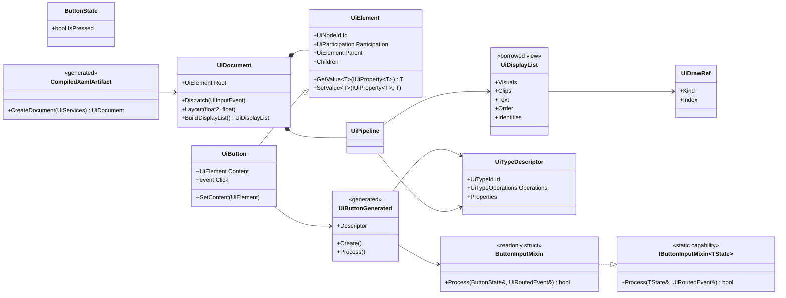

# DeltaXAML internal architecture

This document is the authoritative implementation architecture for DeltaXAML.
It is explicitly internal: it does not replace the consumer-facing
[LIBRARY_CONTRACT.md](LIBRARY_CONTRACT.md) or the frozen cross-project
[CONTRACT.md](CONTRACT.md).

The selected target is a retained UI library with compiled XAML, typed state,
static generic mixins, generated descriptors and a renderer-neutral borrowed
display list. Migration work converges on this architecture without creating a
second retained tree or extending superseded APIs.

## Design objective

DeltaXAML must provide a practical, extensible XAML UI while keeping runtime
code close to a game-engine data pipeline:

- element identity is retained and stable;
- state is explicit, typed and locally owned;
- behavior is composed instead of inherited;
- XAML, bindings, property access and operation dispatch are compiled;
- the steady-state path has no reflection, boxing or string lookup;
- invalidation limits work to affected subtrees and stages;
- the host owns input acquisition, scheduling and time;
- DeltaText owns shaping and glyph generation;
- DeltaRender owns Vulkan resources, pipelines and submission;
- DeltaXAML only produces the canonical `UiDisplayList`.

The code should read in execution order. A reader must be able to see what
state enters a stage, what it mutates, what memory it borrows and which project
owns the result.

### Consumer sample dependency modes

Samples use a package reference only when the producer release is available
from the configured feed. `DeltaMaths` is currently the only cross-repository
runtime package consumed by the samples (`Version="*"`, through the
authenticated GitHub Packages source configured by CI).

The following sample references are intentionally source-only until their
producer packages are published: `DeltaText`, `Delta.Diagnostics.Contract`,
`DeltaRender`, `DeltaRender.Platform.SDL3`, `DeltaRender.Vulkan`,
`DeltaRender.Text`, `DeltaRender.XAML`, `DeltaShader.UI` and
`DeltaShader.Text`. They remain sibling `ProjectReference` edges so a local
checkout describes the real implementation graph; no fake package source or
unpublished package version is used. `DeltaXAML`, `DeltaXAML.Contract`,
`DeltaXAML.Compiler` and `DeltaXAML.Generator` remain local repository
references, with Compiler/Generator serving the build-time path.

## Lessons retained from other XAML systems

DeltaXAML deliberately adopts these proven ideas:

- property metadata for defaults, validation, precedence and invalidation;
- compiled bindings with compile-time path diagnostics;
- XAML source generation instead of production runtime inflation;
- generated property/command mapping instead of per-control subscriptions;
- separate logical and visual trees where templates require them;
- reusable templates, resources, styles and selector plans.

It deliberately does not reproduce:

- an `object`-valued `BindableObject` property bag;
- `Dictionary<string, Action<...>>` dispatch in the frame path;
- platform handler/renderer layers: DeltaRender has one Vulkan backend;
- deep control inheritance;
- global mutable mapper customization;
- reflection-based production loading or binding;
- framework ownership of the window, loop, clock or application lifecycle.

## Governing rules

### DeltaXAML is a library

`UiDocument` owns retained UI state. It does not own a window, thread, update
loop, renderer, global clock or application lifetime. A game and the editor use
the same flow:

```csharp
document.Dispatch(input);
document.Layout(viewport, dpiScale);

UiDisplayList displayList = document.BuildDisplayList();
xamlRenderer.AddToGraph(displayList, graph, target);
```

The host decides where the UI pass is inserted. A game may add it after the
world pass for HUD rendering, before post-processing, or into an off-screen
target for world-space UI. No DeltaXAML API requires DeltaEditor.

### Identity, state, capability and algorithm are separate

The precise rule is:

> An element class owns identity and its composite state. A generic interface
> describes one capability. A stateless `readonly struct` implements its
> algorithm. Generated code binds the concrete element, state and algorithms.

This is stricter than putting default algorithms directly into interfaces.
Static generic calls let the JIT see concrete state and algorithm types, while
the generated descriptor provides one uniform runtime entry point for a
heterogeneous retained tree.

### No runtime state lookup by `Type`

Generic state is not retrieved through `Dictionary<Type, object>`. The source
generator resolves `UiButton -> ButtonState -> ButtonInputMixin` at compile
time and emits a direct typed thunk. The hot path performs at most one
descriptor operation call per element and stage; the algorithm then receives
`ref ButtonState` directly.

### One retained model

Loader, public controls, styles, bindings, layout, hit testing and extraction
operate on the same element identity and property sources. An adapter must not
rebuild a parallel object graph, duplicate property values or translate the
entire tree every frame.

## Runtime overview

```text
XAML source
    -> parser
    -> typed semantic model + Delta.Diagnostics source ranges
    -> generated factories, setters, bindings and descriptors
    -> one retained UiDocument

host input / property writes
    -> mutations
    -> bindings
    -> style and effective-value resolution
    -> measure
    -> arrange
    -> hit-test/focus state
    -> visual extraction
    -> borrowed UiDisplayList
    -> DeltaRender Vulkan RenderGraph
```

Every phase has one owner and explicit inputs. There is no general event bus or
monolithic `ProcessEverything` facade.

## Internal runtime types

The following declarations describe implementation shape. Public signatures
remain governed by `LIBRARY_CONTRACT.md`.

```csharp
internal readonly record struct UiNodeId(
    uint Index,
    uint Generation);

internal readonly record struct UiRuntimeTypeIndex(int Value);

internal struct UiNodeRecord
{
    public UiElement Element;
    public UiNodeId Parent;
    public UiNodeId FirstLogicalChild;
    public UiNodeId NextLogicalSibling;
    public UiNodeId FirstVisualChild;
    public UiNodeId NextVisualSibling;
    public UiRuntimeTypeIndex RuntimeType;
    public UiDirtyFlags Dirty;
}
```

`UiNodeId` and runtime indices are compact process-local values. Durable type,
property, resource and semantic visual identities remain typed `Guid` wrappers
as required by the public contracts.

## Composite state

State structs contain fields and constants only. They contain no layout,
validation, subscription, allocation or rendering behavior.

```csharp
internal struct LayoutState
{
    public float2 RequestedSize;
    public float2 DesiredSize;
    public float4 Bounds;
    public float4 Margin;
    public float4 Padding;
}

internal struct VisualState
{
    public float4 BackgroundColor;
    public float4 ForegroundColor;
    public UiVisualTypeId VisualType;
}

internal struct InteractionState
{
    public UiInteractionFlags Flags;
    public uint CapturedPointer;
}

internal struct ButtonState
{
    public bool IsPressed;
}
```

Each concrete control has one aggregate state type. Common state components
are embedded by value. This keeps access direct and makes the state required by
each capability visible without introducing an entity-component store inside
the UI library. A button's label is content, normally a `TextBlock`; it is
not duplicated as button state.

## Static generic mixins

Capability interfaces contain no mutable instance state. Algorithms live in
stateless `readonly struct` providers and are invoked through static generic
constraints.

```csharp
internal interface IMeasureMixin<TState>
    where TState : struct
{
    static abstract void Measure(
        ref TState state,
        in UiMeasureContext context);
}

internal interface IArrangeMixin<TState>
    where TState : struct
{
    static abstract void Arrange(
        ref TState state,
        in UiArrangeContext context);
}

internal interface IInputMixin<TState>
    where TState : struct
{
    static abstract bool ProcessInput(
        ref TState state,
        in UiInputPacket input);
}

internal interface IVisualMixin<TState>
    where TState : struct
{
    static abstract UiTextRun EmitVisual(
        ref TState state,
        in UiTextVisualContext context);
}

internal readonly struct ButtonInputMixin : IButtonInputMixin<ButtonState>
{
    public static bool Process(
        ref ButtonState state,
        in UiRoutedEvent routedEvent)
    {
        if (routedEvent.Kind == UiPointerEventKind.ButtonDown)
        {
            state.IsPressed = true;
            return false;
        }

        if (routedEvent.Kind == UiPointerEventKind.ButtonUp)
        {
            state.IsPressed = false;
            return true;
        }

        return false;
    }
}
```

The first migrated leaf uses the same shape in
`Internal/State/TextBlockState.cs`: `TextBlockState` embeds
`TextBlockLayoutState` and `TextBlockVisualState` and keeps text content as a
field. `TextBlockMixin.cs` supplies the measure, arrange, input and visual
capabilities; `TextBlockDescriptor.cs` is the direct typed companion used by
the retained `TextBlock` path. The input capability intentionally returns
`false` because a text display leaf does not consume input.

The first migrated container uses the same capability path in
`Internal/State/StackPanelState.cs`, `Internal/Mixins/StackPanelMixin.cs` and
`Internal/Descriptors/UiStackPanelDescriptor.cs`. Its state owns orientation
and layout results; the stateless mixins perform child measure/arrange through
the one retained child list, and the generated companion supplies the typed
dispatch. `StackPanel` does not inherit the `Panel` algorithm. The
All other built-in controls use the same descriptor path across the content,
layout, input/editing and items/scroll slices below.

The content/layout slice adds `BorderState` and `ContentControlState` with
their stateless measure/arrange mixins and typed companions. `Border` owns no
second child model: the mixins receive the existing retained child view, apply
padding and write the composite layout result. `ContentControl` uses the same
single-child view. Button input is dispatched through its generated
companion while Click remains the existing event boundary.

The panel/layout slice adds `PanelState` and `GridState` with the same typed
dispatch. `Panel` keeps only its composite geometry in state while
`PanelLayoutMixin` measures the largest child and arranges all children into
the panel slot. `GridState` owns reusable definition and resolved-size arrays;
`GridMeasureMixin` and `GridArrangeMixin` implement fixed/auto/star sizing
without per-layout replacement arrays. `UiPanelGridDescriptors.cs` is the
typed factory, layout and property-setter companion for these controls.

The button/input slice adds `ButtonState` and `ToggleButtonState`. The
`ButtonInputMixin` and `ToggleButtonInputMixin` keep pointer transitions
stateless; generated companions expose factory/input dispatch, and the
retained button classes only synchronize state with the existing routed-event
and Click boundary.

The editing slice adds `TextBoxState` for caret/selection and
`NumericEditorState` for value/range/commit state. `TextBoxEditingMixin` owns
physical-key mapping, while `NumericValidationMixin` owns range parsing and
step validation. Clipboard, undo/redo, text events and diagnostics remain on
the existing retained owner boundary.

The items/scroll slice adds `ItemsControlState` and `ScrollViewerState`.
`ItemsControlMutationMixin` reuses unchanged realized rows through typed
source/factory interfaces and a retained scratch list. `ScrollViewerMixin`
owns content measure and offset arrange; scrolling is a state mutation that
invalidates arrange/visual output only when the offset changes.

A mixin owns one coherent capability. It must not discover other capabilities
through service lookup. If two algorithms share data, that data belongs to an
explicit state component or a typed stage context.

## Control classes

Control classes are flat composition shells:

```csharp
public class UiButton : UiElement
{
    private Button StateOwner => (Button)RetainedElement;

    public UiElement? Content => Children.Count == 0 ? null : Children[0];

    public event EventHandler? Click
    {
        add => StateOwner.Click += value;
        remove => StateOwner.Click -= value;
    }

    public void SetContent(UiElement? content) => this.SetSingleChild(content);
}
```

`UiButton` has no separate `Text` property. Explicit composition uses a
`TextBlock` child so text has one owner, one property path and one visual
extraction path.

A control may declare:

- state fields;
- constructors that establish valid initial state;
- property and event accessors;
- explicit child/content operations that forward to the single retained tree;
- the internal `ref` state accessor required by generated code.

It may not declare layout, input, visual, binding or validation algorithms;
private domain helpers; per-instance behavior delegates; subscriptions; or
temporary allocation logic.

`UiElement` is the single identity base. Specialized control inheritance is
not an algorithm-composition mechanism. A reusable capability is a state
component plus mixin, not another base class.

## Generated descriptors

The source generator emits a companion type rather than requiring user
controls to be `partial`.

```csharp
internal static class UiButtonGenerated
{
    internal static readonly UiTypeDescriptor Descriptor =
        new(
            new UiRuntimeTypeIndex(7),
            UiDescriptorCapabilities.Factory |
            UiDescriptorCapabilities.Input);

    internal static Button Create() => new();

    internal static bool Process(
        ref ButtonState state,
        in UiRoutedEvent routedEvent) =>
        ButtonInputMixin.Process(ref state, in routedEvent);
}
```

`UiTypeDescriptor` is immutable after registration and contains:

- stable `UiTypeId`;
- factory entry point;
- operation thunks for supported capabilities;
- property descriptors and typed setter thunks;
- content/children metadata;
- template and selector metadata required by the runtime.

Descriptors use compact indices or generated function tables. They do not use
string dictionaries in the frame path. Human-readable names and `Type` values
are cold metadata for tooling and diagnostics only.

The current exemplar registers its immutable metadata in a compact generated
descriptor catalog indexed from one. Catalog lookup validates the index and
returns only metadata; it does not create a second tree or retain per-instance
delegates. The resolved `TextBlock` operations remain the companion's direct
typed thunks and receive `ref TextBlockState`.

## Property system

The public property system keeps typed and untyped views because the XAML
loader and editor need discovery, while compiled runtime access remains typed.

```csharp
public interface IUiProperty
{
    UiPropertyId Id { get; }
    string Name { get; }
    Type ValueType { get; }
}

public interface IUiProperty<T> : IUiProperty
{
    T DefaultValue { get; }
    UiInvalidation Invalidation { get; }
}
```

The canonical migration path still has one retained `UiPropertyStore`, but its
source slots are a cold mutation boundary. A source write resolves a compact
`UiPropertyKey` once and invokes the owning element's generated typed setter;
the setter writes directly into that element's composite state. The store does
not retain per-property apply delegates. The untyped path may box for loader,
editor inspection and runtime diagnostics because it is explicitly cold.

Effective-value precedence remains:

```text
Default < Style/Trigger < Binding < Local < Handle < Animation
```

The explicit resolver table is the only precedence source of truth. It includes
the internal animation layer above host handles, while public callers continue
to use the documented local/style/binding/handle sources. Resolving an
effective value writes the typed result into the concrete control state, so
layout, input and visual mixins do not query the property engine. Equal typed
values update source metadata without repeating invalidation or setter work;
the source slot remains reversible for a later `Clear`.

Property metadata declares exact invalidation:

```csharp
[Flags]
internal enum UiInvalidation : byte
{
    None = 0,
    Measure = 1 << 0,
    Arrange = 1 << 1,
    Visual = 1 << 2,
    HitTest = 1 << 3,
}
```

Validation and coercion run when a source value changes, not during layout or
visual extraction.

## Compiled XAML

Production XAML uses one compile-time pipeline:

```text
XML tokens
  -> namespace/type/property resolution
  -> typed semantic tree
  -> resources/styles/templates/selectors
  -> typed binding plans
  -> generated factories and setters
  -> source map and Delta.Diagnostics
```

The generated artifact contains:

- direct element factories;
- direct typed property setters;
- content and child attachment operations;
- compiled resource identities;
- compiled binding accessors;
- template factories and name-scope tables;
- selector/state-machine plans;
- source locations for every generated diagnostic.

Production loading performs no assembly scan, `Activator.CreateInstance`,
property-name reflection or string binding traversal. A separate runtime
inflation path may exist for designer/hot-reload tooling, but it must produce
the same semantic artifact and must not become a fallback silently used in a
shipping build.

## Bindings

Compiled bindings use generated typed read/write accessors. A simple binding
does not allocate a closure and does not resolve a dotted string path per
update. `OneTime` creates no subscription. `OneWay` and `TwoWay` register only
the source notifications required by their generated plan.

`INotifyPropertyChanged` remains an optional source-notification mechanism. Engine and
editor hot paths should prefer generation-safe `UiPropertyHandle` writes and
batched mutations. Binding notifications are collected, deduplicated and
applied before layout; a callback must not recursively run layout.

## Trees, templates and storage

One `UiNodeId` identifies an element across the logical and visual trees.
Templates may create a different visual subtree while preserving the logical
owner. Parent/child relations are stored in compact tables rather than a
separate `List<T>` allocation per runtime operation.

Tree mutation validates:

- generation and document ownership;
- duplicate parentage;
- cycles;
- logical/visual lifetime consistency;
- name-scope ownership.

Templates are generated factories. Applying or replacing a template updates
only the affected visual subtree and corresponding selector/layout plans.

## Styles, resources and visual states

Styles compile into selector plans. Selector matching does not walk arbitrary
reflection metadata. Static and dynamic resource references resolve to stable
`Guid`-backed identities; runtime slots remain compact integers.

Interaction and user state are ordinary typed flags. Visual-state changes feed
the same effective-value resolver as styles and therefore reuse property
precedence and invalidation. They are not an event-driven second property
system.

## Input, focus and commands

The host supplies normalized `Delta.XAML.Contract.UiInputEvent` packets.
DeltaXAML owns hit testing, capture, focus, routing and control semantics.

The input stage performs:

```text
packet normalization already done by host
  -> hit-test candidate lookup
  -> capture/focus resolution
  -> route construction
  -> typed input mixin calls
  -> queued property/tree mutations
```

Commands are semantic actions, not renderer commands. Property changes and
commands remain separate in descriptors: a property represents retained
state, while a command requests an operation such as scroll, submit or focus.

## Layout

Measure and arrange are separate explicit stages. Dirty flags propagate only
as far as metadata requires. The steady-state stage binds a descriptor and
state once per element; inner maths operates on concrete structs and
`Delta.Maths` values.

Layout must not:

- inspect CLR property names;
- allocate temporary child collections;
- invoke user bindings;
- shape text repeatedly when the shaping key is unchanged;
- rebuild unaffected subtrees.

## Visual extraction and text

Visual mixins emit renderer-neutral commands into reused builders. Extraction
does not create Vulkan resources or renderer pipelines. Custom visuals use the
stable `UiVisualTypeId`; DeltaRender resolves that identity to its registered
implementation.

All extracted bounds, clips and text baselines use the canonical top-left
logical UI space. Apart from the separate DPI conversion, the Vulkan consumer
uses a top-left positive-height viewport and its fixed logical-pixel to clip
projection is the only coordinate conversion. Visual extraction must not
pre-flip Y for a backend, and texture UV orientation is an upload/atlas concern
rather than a retained-state rule.
Normal-map green-channel orientation is explicit material metadata and is
independent of framebuffer orientation.

Text layout calls `DeltaText.Contract.ITextService`. DeltaText returns shaped
positions and glyph images; DeltaXAML places shaped text and emits
`UiTextDraw` with text payload, baseline, paint and clip. The visual stage
writes the retained owner slot, lifetime generation and producer version into
the corresponding `UiElementIdentity` entry aligned with `UiDisplayList.Order`;
DeltaRender owns atlas packing, UV assignment, staging, shader selection and
GPU lifetime.

`UiDisplayList` is a borrowed view over document-owned storage and is invalid
after the next mutation or extraction, as defined by the frozen contract.

## Pipeline implementation

`UiDocument` is the small public ownership boundary. It delegates to focused
internal stages:

```csharp
internal sealed class UiPipeline
{
    private readonly UiMutationEngine _mutations;
    private readonly UiBindingEngine _bindings;
    private readonly UiStyleEngine _styles;
    private readonly UiLayoutEngine _layout;
    private readonly UiInputEngine _input;
    private readonly UiVisualEngine _visuals;

    public void Build(
        UiDocumentState state,
        float2 viewport,
        float dpiScale,
        ref UiDisplayListBuilder output)
    {
        _mutations.ApplyPending(state);
        _bindings.ApplyChanged(state);
        _styles.ResolveChanged(state);
        _layout.MeasureAndArrange(state, viewport, dpiScale);
        _visuals.Emit(state, ref output);
    }
}
```

The pipeline exposes order, not a general framework. Engines have narrow data
dependencies and do not call one another through a service locator.

## Full-capability implementation

The full-capability dialect extends the fixed pipeline through focused plans
and stores. It does not add methods to a monolithic `UiDocument` facade and
does not introduce a second runtime. Compile-time declarations converge on the
same descriptor, node, property and stage data used by the baseline.

### Typed repeater and virtualization

The primitive collection runtime has four independent parts:

```text
typed source view     Count, item/key access and a structural stamp
typed template plan   Create, Bind and Unbind thunks
realization store     item/key/index -> generation-safe UiNodeId
virtualizing layout   viewport -> required index ranges
```

Template thunks are generated static operations. A realized element stores its
source index/key and descriptor, not an `object` item. Recycled elements are
pooled by template descriptor. Structural collection deltas update the index
map and realize/recycle only affected ranges. The repeater has no built-in
selection, scroll viewer or item chrome; those are policies composed above it.

### Relation bindings and attached slots

Binding source plans use a compact discriminant:

```text
Context | Self | TemplateOwner | Name | Ancestor
```

`Self`, template owner and namescope links bind once during construction. An
ancestor plan stores the required descriptor/type identity and a cached
`UiNodeId`; attach/reparent invalidates and resolves that cache. Binding refresh
then reads the cached node directly.

Attached properties are generated typed slots associated with an owner
descriptor. Built-in layout properties receive direct indices in node state.
Custom cold-path attached properties may use the existing typed property store.
Neither path uses `Type` or object-keyed storage.

### Condition graph

The compiler lowers triggers and visual states to:

```text
dependency property slots
  -> typed condition thunk
  -> active-state bit
  -> generated setter range
  -> optional semantic command
```

Property invalidation queues dependent condition indices. A condition is
evaluated at most once per stage generation. Setter output feeds the existing
effective-value precedence and cannot mutate layout recursively. Commands are
published only after the stage commits its mutations.

### Capabilities and gesture arena

Generated descriptors opt an element into behavior/gesture capabilities.
Optional capability state is part of concrete composite state and exists only
for participating element types. Stateless mixins process it by `ref`.

One document-owned gesture arena stores only active pointer candidates. It
arbitrates capture and recognition from normalized packets and host timestamps.
No recognizer object, timer, event subscription or delegate is allocated per
element. Recognized gestures become routed typed input operations or semantic
commands.

### Overlay and focus scopes

Popups, drop-downs, tooltips and menus use a document-owned overlay root that
belongs to the same node store and pipeline. An overlay may establish a focus
scope and capture policy, but it is not another document or native window.
Placement is a layout capability receiving anchor and viewport bounds.

### Rich paragraphs

Rich text is stored as one paragraph text buffer plus compact style/action
runs. A paragraph layout key includes text/run versions, font instances,
language/script/direction/features, width and DPI. Shaping/layout produces
positioned runs and inline hit ranges. Color-only changes reuse glyph shaping.
Visual extraction writes the runs directly as canonical `UiTextDraw` values.

### Resources, brushes and images

Brush state is a compact tagged value containing a solid color or stable
resource identity. Gradients and images remain resource-backed; an optional
renderer-neutral metadata resolver supplies intrinsic pixel dimensions and
readiness for measure/placeholder state. It cannot expose decoded platform or
GPU objects. Dynamic resource changes reuse dependency invalidation.

### Accessibility snapshot

Accessibility extraction is a separate read-only stage over the same node
store. It emits borrowed compact semantic nodes only for elements whose
semantic state changed. Platform automation objects, callbacks and lifetimes
remain host-owned. Accessibility does not walk or mutate the visual command
list.

### Full-capability cost rules

- no reflection, boxing, LINQ, string member lookup or expression compilation
  in retained stages;
- no per-item container unless a high-policy control explicitly requests one;
- no per-element behavior/trigger/gesture objects or delegate chains;
- no parent traversal during steady-state binding refresh;
- no full collection rebuild for bounded add/remove/move/replace deltas;
- no reshaping for paint-only rich-text changes;
- no platform, renderer or GPU object in retained state;
- all buffers and realization tables are document-owned and reused.

The architecture gate verifies these constraints and that full-capability XAML
fixtures compile to typed artifacts rather than use the cold loader or a
host-built substitute tree.

## Cost zones

### Hot

Per node, child, glyph and visual-command operations use arrays/spans, compact
indices, typed state, `ref` access and generated thunks. No LINQ, reflection,
boxing, `Type` lookup, string lookup, closure allocation or unbounded delegate
chain is allowed.

### Warm

Per document build, dirty subtree, template application or mutation batch may
use cached plans and bounded dictionaries. Buffers are reused and capacity
growth happens before traversal when possible.

### Cold

Compilation, source diagnostics, editor inspection and optional runtime
designer inflation may use richer object graphs, reflection and boxing when it
makes the boundary clearer. Cold representations never cross into layout,
input or visual extraction.

## Required source layout

```text
src/DeltaXAML/
  UserApi/
    Controls/Ui*.cs            flat identity/state access shells
    Properties/                typed public property API
    Bindings/                  typed user binding API
  Internal/
    State/*State.cs            data only
    Mixins/*Mixin.cs           stateless algorithms
    Descriptors/               generated/runtime operation metadata
    Compilation/               semantic artifact consumption
    Properties/                precedence and typed value pools
    Bindings/                  generated plans and notification collection
    Tree/                      logical/visual retained tables
    Input/                     hit test, focus, capture and routing
    Layout/                    measure and arrange stages
    Visuals/                   display-list builders and extraction
```

Generated companions may live under `obj/Generated/DeltaXAML` or an explicit
generated source project. User-authored controls are never required to be
`partial` merely to receive generated runtime behavior.

## UML



## Architecture gate

The executable DeltaXAML architecture gate must reject:

- control classes with non-accessor domain methods;
- control inheritance used to share algorithms;
- state structs containing methods, reference-owned services or allocations;
- mixin structs containing instance fields;
- default interface algorithms that become runtime dispatch;
- `Dictionary<Type, object>` or object-valued storage in runtime stages;
- reflection, LINQ and string property lookup in layout/input/visual paths;
- per-instance behavior delegates or event subscriptions inside controls;
- generated companions that require user controls to be `partial`;
- new implementation references to superseded APIs.

The gate applies to every designated state, mixin, descriptor and public
control type, plus bounded source checks over runtime hot paths.

## Final implementation classification

The executable gate requires every designated folder to be populated and
reports an empty folder as `PENDING`. The final path is classified by ownership,
not by a second facade or tree:

| Path | Classification | Boundary rule |
|---|---|---|
| `Internal/Tree/RetainedElement.cs` | canonical retained owner | Owns one element identity, composite state and property-source slots; it does not own traversal or frame scheduling. |
| `Internal/UiNodeStore.cs` | canonical relation/index owner | Owns logical and visual links for the same generation-safe `UiNodeId` and resolves handles in O(1). |
| `Internal/State/**` | canonical state | State-only value types; no algorithms, services or relation ownership. |
| `Internal/Mixins/**` | canonical algorithms | Stateless readonly algorithms behind static generic capability shapes. |
| `Internal/Descriptors/**` | canonical dispatch | Compact runtime type indices, typed factories and typed state/property thunks. |
| `Internal/Stages/UiRuntimeStages.cs` | canonical pipeline | Runs input, mutation, binding, style, measure, arrange and focus work over reusable queues. |
| `Internal/Visuals/**` | canonical extraction | Writes frozen contract commands directly into reusable document-owned storage and owns shaped-text cache entries. |
| `Internal/Compilation/InterpretedXamlReader.cs` | explicit cold source reader | Used only when a caller chooses `IXamlLoader`; construction converges on the canonical retained owner and descriptors. |
| `Internal/Bindings/UiInterpretedBinding.cs` | explicit cold string binding | Used only by the public string binding/source-loading entry point; generated production artifacts use typed compiled bindings. |
| `UserApi/UiElement.cs` and `UserApi/Controls/**` | public identity/accessors | Thin shells over the canonical retained owner; no parallel relation or property storage. |
| `UserApi/XamlLoader.cs` | public cold loader | Required by the frozen library contract; it is not a shipping fallback selected by generated artifacts. |
| `Internal/RetainedContracts.cs` | internal runtime vocabulary | Typed stage records and platform-neutral adapters only; no cross-project contract duplication. |

There are no remaining superseded files, obsolete production symbols or
production callers of a replaced execution path. The architecture gate scans
the designated state/mixin/descriptor/control folders and separately rejects
forbidden operations in runtime hot paths.

## Migration and removal policy

Migration is complete only when the new path is the sole active path. If an
old API, benchmark, test or implementation cannot be removed in the same
change, it must be marked `[Obsolete]` with:

- the replacement API or removal destination;
- an error severity when no supported caller may remain;
- a TODO reference or removal milestone when temporary compilation is needed.

```csharp
[Obsolete(
    "Use UiTypeDescriptor generated operations; remove during DXAML-MIXIN-4.",
    error: true)]
internal void RetiredMeasure()
{
}
```

An unmarked superseded surface is considered an accidentally supported API.
New code, tests and benchmarks must not call an obsolete path. A temporary
adapter must not be optimized or extended and must be deleted at its recorded
milestone.

## Final migration state

- Generated companions are the production path for construction, bindings,
  resources, styles, states and templates.
- The explicit cold loader and cold string binding APIs converge on the same
  descriptors, retained owner, property store, node store and stages.
- `UiVisualStage` writes directly to document-owned `UiDisplayListStorage`;
  editor and game fixtures consume the same borrowed frozen-contract view.
- Stable resource slots feed the existing property precedence resolver and
  queue only dependent style/resource work.
- No superseded production symbol remains and no `[Obsolete]` symbol has an
  active caller.

## Remaining implementation specification

This section records the execution plan used after the completed
`DXAML-MIXIN-1` through `DXAML-MIXIN-5` baseline. It documents the implemented
pipeline; it does not create selected work in `TODO.md` or change
`LIBRARY_CONTRACT.md`, `CONTRACT.md` or the types in
`src/DeltaXAML.Contract`. If this section and a public contract disagree, the
public contract wins instead of inventing an adapter.

The final implementation has one production path:

```text
XAML source
  -> typed compile-time artifact
  -> one retained UiDocumentState
  -> fixed stages over generation-safe nodes
  -> canonical borrowed UiDisplayList
```

There must not be a second object tree, a translated prior draw list, a
reflection fallback selected in shipping code or a facade around
the old runtime.

### Delivery order

Implement these slices in order. A later slice may introduce declarations
needed by the current slice, but it must not keep two active implementations.

| Slice | TODO owner | Result |
|---|---|---|
| `DXAML-COMPILE-1` | compilation | One typed semantic model with exact source ranges and stable identities. |
| `DXAML-COMPILE-2` | generation | Direct factories, setters, attachment, namescopes and descriptor registration. |
| `DXAML-COMPILE-3` | binding | Generated typed read/write batches without steady-state path traversal or closures. |
| `DXAML-COMPILE-4` | styling | Compiled resources, selectors, styles, states and template factories. |
| `DXAML-RUNTIME-1` | retained storage | One generation-safe node store for logical and visual relations. |
| `DXAML-RUNTIME-2` | stages | Fixed input, mutation, binding, style, measure, arrange and visual stages. |
| `DXAML-RUNTIME-3` | extraction | Direct canonical `UiDisplayList` output and stable text caching. |
| `DXAML-RUNTIME-4` | removal/integration | Remove the obsolete retained runtime and finish editor/game input and resize paths. |

### Compile-time projects and ownership

Keep the runtime library small. Compile-time implementation belongs in two
supplementary projects only when `DXAML-COMPILE-1/2` begins:

```text
src/DeltaXAML.Compiler/
  Internal/Compilation/       XML reading, semantic model and diagnostics
  Internal/Plans/             immutable typed plans

src/DeltaXAML.Generator/
  IncrementalGenerator.cs     Roslyn AdditionalFiles adapter only
  Emission/                   C# source emission from typed plans
```

`DeltaXAML.Compiler` owns the source-to-plan pipeline and may be reused by an
explicit designer/hot-reload tool. `DeltaXAML.Generator` only supplies Roslyn
incremental inputs and emits C#; it must not contain a second parser or semantic
model. Neither project is a cross-project runtime contract. Runtime
`DeltaXAML` consumes generated C# and does not reference Roslyn.

Compilation is cold and may use immutable object graphs. Generated runtime
artifacts contain compact IDs, literal values and direct typed operations;
they do not retain XML nodes, `Type`, reflection metadata or property paths.

### `DXAML-COMPILE-1`: typed semantic model

The compiler pipeline is explicit and deterministic:

```text
XML token + source range
  -> namespace/name resolution
  -> UiTypeId / UiPropertyId resolution
  -> content-model validation
  -> typed literal/resource/binding value plan
  -> namescope/template/style validation
  -> immutable XamlDocumentPlan
```

The first implementation lives in the cold-only `DeltaXAML.Compiler` project.
`XamlSemanticRegistry` accepts stable, caller-assigned `UiTypeId`,
`UiPropertyId` and `UiResourceId` values; it never creates durable identities
from process-random values. `XamlCompiler` emits one immutable plan model with
typed literal/resource/binding values, exact UTF-16 `SourceRange` offsets and
diagnostics for unknown names, invalid values, duplicate names and unsupported
content. Its hand-written XML reader recovers at the next attribute or sibling
element so one compile can report multiple local errors. The compiler project
does not participate in runtime layout, input or visual extraction, and the
runtime `DeltaXAML` project does not reference it.

`XamlObjectPlan.ScopeName` carries an `x:Name` declaration for the generated
namescope. Built-in `XamlTypeDefinition` entries also carry explicit direct
factory expressions. The compiler indexes those definitions by stable
`UiTypeId`, so generation does not need to rediscover a CLR type.

Use one representation with these responsibilities (names may change only if
the responsibility remains one-to-one):

```csharp
internal sealed record XamlDocumentPlan(
    SourceId Source,
    XamlObjectPlan? Root,
    ImmutableArray<XamlResourcePlan> Resources,
    ImmutableArray<XamlStylePlan> Styles,
    ImmutableArray<XamlTemplatePlan> Templates,
    ImmutableArray<Diagnostic> Diagnostics);

internal sealed record XamlObjectPlan(
    UiTypeId Type,
    XamlQualifiedName Name,
    string? ScopeName,
    SourceRange Range,
    ImmutableArray<XamlMemberPlan> Members,
    ImmutableArray<XamlObjectPlan> Children);

internal readonly record struct XamlMemberPlan(
    UiPropertyId Property,
    XamlValuePlan Value,
    SourceRange Range);
```

Every syntax node that can fail resolution carries a `SourceRange`. Unknown
names, invalid content, duplicate names, incompatible values and unsupported
markup extensions produce `Delta.Diagnostics` entries and recovery continues
at the next attribute or sibling element so one build reports multiple errors.

Stable IDs come from registered metadata or explicit generated declarations.
Never derive a durable GUID from process-random hashes. Source order determines
generated local indices, and identical input plus identical registries must
emit byte-for-byte identical generated C#.

### `DXAML-COMPILE-2`: generated document construction

Generate a companion factory; do not modify a user control or require it to be
`partial`. The generated method constructs the final retained document
directly:

```text
create typed element
  -> register/resolve immutable descriptor
  -> apply typed literal and resource setters
  -> attach logical child/content
  -> record namescope slot
  -> instantiate template plan when required
  -> return UiDocument
```

`DeltaXAML.Generator` is the build-time companion. Its Roslyn incremental
entry point reads `.xaml` additional texts, invokes the one compiler plan, and
adds a deterministic `Xaml_<file>_<stable-hash>` artifact. The artifact owns
one final `UiDocument`, invokes direct public typed setters, and emits one
compact `_scopeElements` table plus a generated `TryFindName` switch. A
literal-only built-in document is therefore constructed without an XML reader
or runtime factory lookup. Custom registry entries must provide an explicit
factory expression; otherwise generation reports `DXAMLGEN001`. A custom
property must additionally provide a qualified static setter expression; the
emitter calls that thunk with the concrete node and typed literal. A custom
children or single-content owner likewise provides a qualified static
attachment thunk; the emitter calls it with the generated parent and child
variables. Bindings and resource references remain restricted to properties
with a generated `UiProperty<T>` descriptor, so a custom literal cannot
silently fall back to string dispatch.

The compiler registry validates and indexes immutable custom type/property
metadata once per compilation. Built-in runtime descriptor companions remain
the only frame-operation catalog; an attributed custom type uses canonical
common element state and composes built-in controls or a semantic custom
visual. The public authoring contract does not expose arbitrary custom
frame-stage mixin registration. Generated code calls direct typed companion
operations and must not call
`Activator.CreateInstance`, set properties by name, use `dynamic`, enumerate
assemblies or create a dictionary per element. A namescope uses one generated
compact table per scope; source names are retained only because name lookup is
a user feature, not as runtime identities.

Custom descriptor registration is the compiler-side `XamlSemanticRegistry`
validation and stable-ID index plus direct generated factory/setter/attachment
thunks. Custom types inherit the common typed XAML properties. A custom
property without a direct setter, or a binding/resource/style target without a
public `UiProperty<T>` descriptor, is a build diagnostic rather than runtime
string dispatch.

`IXamlLoader.Load(string, ...)` remains an explicit cold/tooling path. Shipping
generated construction never silently calls it. If the build cannot generate
an artifact, it reports a build diagnostic instead of producing reflection
fallback code.

The current generator accepts literal values, the existing typed child/content
operations, and binding plans that have an explicit
`XamlBindingDefinition` in the registry. Binding definitions supply source and
value type names plus direct accessor expressions; the artifact emits static
typed lambdas and one direct refresh/dispose batch. `OneTime` has no source
subscription. Resource references and bindings without a typed definition
produce `DXAMLGEN002` rather than a string-path or reflection fallback.

### `DXAML-COMPILE-3`: compiled binding batches

Each binding is resolved against a declared source type during compilation.
The artifact generates direct member reads and, for `TwoWay`, direct writes.
The generated document groups its concrete bindings into a typed batch so one
batch dispatch may contain many property updates; there is no heterogeneous
`object`/delegate call per property in the steady state.

```text
OneTime  : read once during construction; register no notification
OneWay   : source notification -> deduplicated binding slot -> typed read
TwoWay   : OneWay path + typed target commit -> source write
```

The current implementation represents the declared source contract as an
`XamlBindingDefinition` in `XamlSemanticRegistry`. `CSharpArtifactEmitter`
requires all bindings in one artifact to use that source type, emits static
typed lambdas, attaches them through the source-managed `SetCompiledBinding`
overload, and exposes typed `RefreshBindings`/`Dispose` calls over the binding
fields. The artifact installs one source notification boundary; it only queues
the affected target runtimes, and the next binding stage reads them. Generated
bindings do not subscribe per property. `OneTime` still registers no
notification. Explicit string-path `UiInterpretedBinding` exists only for the
caller-selected cold loader/binding API; generated artifacts never select it.

Binding attachment may allocate notification infrastructure once. A changed
notification only records a compact binding slot. The binding stage later
reads all queued slots and writes through the normal typed property/source
resolver; callbacks never run layout recursively.

Production binding rules:

- no dotted string traversal after compilation;
- no reflection, `dynamic`, boxing or captured lambda in an update;
- nullable segments are validated and generate explicit propagation behavior;
- source conversion and validation are generated typed calls;
- `INotifyPropertyChanged` is an optional notification source, not the
  binding execution engine;
- an unsupported source shape is a compile diagnostic, not a runtime fallback.

### `DXAML-COMPILE-4`: resources, styles and templates

Compile names to stable GUID-backed identities and then to artifact-local
indices. Runtime arrays are indexed by those local values; dictionaries are
per artifact or scope and are not consulted per node during layout or visual
extraction.

Styles compile into:

```text
selector predicate over compact type/state/class indices
  -> ordered typed property writes
  -> exact invalidation metadata
```

Static resources resolve during artifact construction. Dynamic resources keep
a compact dependency list from resource slot to affected property slots; a
resource change queues only those writes. Visual states use the same property
precedence resolver as styles and do not form a second property engine.

Templates are generated factories. The compiler assigns each template a stable
`UiTemplateId`; generated registration and selection use that identity instead
of a runtime template-key lookup. A template creates visual nodes in the same
`UiDocumentState`, assigns their visual parent and templated owner, and does
not create another `UiDocument`. Replacing a template destroys only that
visual subtree and invalidates the affected layout/visual queues. The string
registration/selection overloads remain cold loader/tooling forms.

### `DXAML-RUNTIME-1`: one node store

Replace recursive identity lookup and per-object relation ownership with one
document-owned store. Public `UiElement` instances remain stable identity
shells; internal relations and generations live in indexed records:

```csharp
internal readonly record struct UiNodeId(uint Index, uint Generation);

internal struct UiNodeRecord
{
    internal UiElement Element;
    internal UiRuntimeTypeIndex RuntimeType;
    internal UiNodeId LogicalParent;
    internal UiNodeId VisualParent;
    internal UiNodeId FirstLogicalChild;
    internal UiNodeId FirstVisualChild;
    internal UiNodeId NextLogicalSibling;
    internal UiNodeId NextVisualSibling;
    internal UiDirtyMask Dirty;
}
```

The exact link encoding may use first-child/next-sibling or compact ranges, but
there is one authoritative record per element. `UiNodeId.Index` resolves in
O(1) and generation validation rejects stale handles. Do not add a parallel
`Dictionary<UiElement, ...>` or translate between separate logical and visual
documents. The node store naturally replaces `UiFrame.Find`; no separate
mutation index is justified.

All tree mutation is queued. Applying a mutation validates ownership, stale
generation, duplicate parentage, cycles and logical/visual lifetime before
changing links. Destroying a logical owner also destroys its template-owned
visual subtree and increments released generations.

### `DXAML-RUNTIME-2`: fixed stage pipeline

`UiDocument` owns data and sequences stages; it is not a service locator.
Stages are stateless algorithms over `UiDocumentState`. They do not invoke one
another and do not expose interfaces without a second implementation.

```text
Dispatch()           queues normalized input only

Layout():
  1. input/focus     route queued input against last committed geometry
  2. mutation        apply input and host tree/property mutations
  3. binding         apply deduplicated changed binding slots
  4. style/resource  resolve queued selectors, states and resources
  5. measure         post-order dirty subtrees
  6. arrange         pre-order dirty subtrees and refresh hit geometry
  7. focus repair    release detached/disabled focus and capture

BuildDisplayList():
  8. visual/text     update dirty output ranges and return borrowed spans
```

The first document layout establishes hit-test geometry before input is
accepted. A property write during input enters the mutation stage of the same
`Layout` call. A stage may enqueue work for a later stage, never call it
directly. An illegal earlier-stage invalidation discovered after its barrier
is retained for the next `Layout`; it is not solved through recursion.

Each stage has a reusable dense `UiNodeId[]` queue and a generation/stamp array
for O(1) deduplication. Do not use per-frame `HashSet`, LINQ, recursive list
construction or one heap allocation per node.

### Invalidation and traversal rules

Generated property metadata is the only source of invalidation flags. Compare
the new typed effective value before enqueueing work.

| Flag | Work queued |
|---|---|
| `Binding` | Binding slot only; its resulting typed write adds later flags. |
| `Style` / `Resource` | Affected selector/resource dependency slots only. |
| `Measure` | Node and logical ancestors until an already-dirty boundary. |
| `Arrange` | Node; arranging a parent visits only children whose geometry can change. |
| `HitTest` | Node geometry/capture state after arrange. |
| `Visual` | Node output range and dependent clip/text records. |
| `Tree` | Changed relation, affected ancestors and removed subtree lifetime. |

Measure is post-order; arrange and visual extraction are pre-order in stable
child/Z order. Hidden subtrees obey `UiParticipation` and are skipped without
destroying their retained state. Layout never invokes a binding, resolves a
resource by name or shapes text.

### `DXAML-RUNTIME-3`: canonical extraction and text cache

The visual stage writes `UiVisualDraw`, `UiClipRegion`, `UiTextDraw` and
`UiDrawRef` directly into reusable document-owned arrays. `UiDrawRef` is the
only cross-kind ordering channel: its kind selects the visual or text array and
its index selects the payload. `UiDocument.TryBuildDisplayList` returns spans
over those arrays. It does not first build a second intermediate draw list,
compare a full duplicate previous list or translate every item into the
contract types.

Only dirty node ranges are rewritten; a structural or ordering change may
compact the affected suffix. The returned view is invalid after the next
mutation or extraction exactly as stated by `Delta.XAML.Contract`.

Text shaping is cached by all inputs that can change shaping: retained node
generation, text version, resolved font instance/fallback set, size, direction,
script/language/features and layout constraint. Position/color/clip changes do
not reshape glyphs. Replacing or destroying a cache entry releases the owned
`ShapedText` lifetime according to the DeltaText contract.

Custom visuals emit `UiVisualKind.Custom` with a stable `UiVisualTypeId` and
resource identities. DeltaXAML does not resolve shaders, pipelines, textures
or Vulkan handles.

### `DXAML-RUNTIME-4`: removal and final integration

The final implementation keeps the frozen cold library inputs but gives them no
parallel execution model:

- `Internal/Tree/RetainedElement.cs` is the sole retained identity, composite
  state and property-source owner;
- `UiNodeStore` is the sole logical/visual relation and generation-safe handle
  index;
- `UiRuntimeStages` is the sole input/mutation/binding/style/layout/focus
  pipeline;
- `UiVisualStage` writes canonical contract records directly into reusable
  document-owned storage;
- `UserApi/XamlLoader.cs` and `UiInterpretedBinding` are explicit cold source
  front doors into those same owners and are never generated fallbacks;
- focused user API files expose only the frozen loader/document/element,
  property, binding, style and control surfaces.

The former facade, translated draw-list, recursive public layout entry points,
parallel relation lookup and separate input packet path have been removed.
There are no remaining obsolete production callers.

Final integration acceptance is one path for both editor and game:

```text
platform/engine normalizes input
  -> UiDocument.Dispatch
  -> UiDocument.Layout
  -> UiDocument.BuildDisplayList
  -> consumer adds the borrowed display list to DeltaRender
```

Resize changes viewport/DPI and invalidates only the required measure, arrange,
hit-test and text-cache entries. Pointer capture, focus traversal, keyboard and
IME editing, scrolling and clipping operate through the fixed stages. A game
HUD uses the same document and display-list path; screen, texture or world-space
placement is the renderer consumer's target choice.

### Completion gate

The remaining implementation is complete only when all of these are true:

- every production XAML file has a generated typed artifact;
- production bindings and style/template application have no reflection or
  string traversal;
- `UiDocument` owns one node/property/state model and one fixed stage pipeline;
- public `UiElement` shells contain accessors/state composition, not algorithms;
- canonical contract commands are emitted directly into reused storage;
- unchanged text is not reshaped and unchanged subtrees are not remeasured;
- superseded implementation files have been removed and no obsolete symbol has
  an active caller;
- editor and game HUD paths consume the same `UiDisplayList` boundary;
- Vulkan, SDL, ECS, application clocks and renderer pipelines remain outside
  DeltaXAML.

Completion evidence is executable in the ordinary headless harness: generated
editor and game HUD artifacts use `Dispatch -> Layout -> BuildDisplayList`,
mutation/binding/style/layout stages are ordered and non-recursive, detached
focus/capture is repaired, UTF/IME/scroll/clipping/nested hit testing are
covered, unchanged display extraction reuses storage and shaped text, and the
architecture gate rejects a second runtime path.

## Non-goals

DeltaXAML does not promise byte-for-byte WPF, Avalonia, Xamarin or MAUI
compatibility. It does not own ECS data, SDL events, native windows, Vulkan
submission, font rasterization, a global clock or an application framework.
Feature parity is pursued through the DeltaXAML dialect and compiled semantic
model, not by inheriting another framework's runtime costs.
