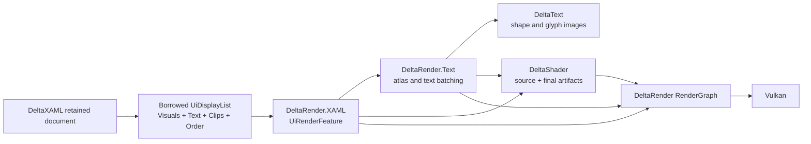

# UI rendering design

This document defines the cross-project design for consuming a DeltaXAML
display list. It does not add a renderer dependency to DeltaXAML. The producer
emits fill/stroke/corner-radius visual paint and text fill/outline/effect
identities; whether a renderer has an artifact and submission path for a
particular kind remains consumer-owned.

## Ownership

| Area | Owner | Responsibility |
|---|---|---|
| XAML and retained state | DeltaXAML | Load, style, layout, invalidation, clip hierarchy, draw order and neutral `UiDisplayList` production |
| Font processing | DeltaText | Font instances, Unicode, shaping and Coverage/SDF/MSDF/color glyph images |
| Shader authoring | DeltaShader | Standard text/UI shader source, validation, final SPIR-V and binary `ShaderAbi` artifacts |
| GPU adapter | DeltaRender.XAML | Consume `UiDisplayList`, resolve resources, build atlas/instance buffers, batch and add RenderGraph passes |
| GPU execution | DeltaRender | RenderGraph, Vulkan resources, synchronization, raster commands and pipeline cache |
| Host | DeltaEngine or game/editor | Window/target, DPI, input acquisition, frame order and animation time |

DeltaXAML must not reference DeltaRender, DeltaShader, Vulkan, SDL, DeltaText
implementation types or Engine/ECS storage. DeltaRender.XAML is a consumer-side
adapter and must not become a second UI tree or property system.

## Frame path



The adapter iterates only `UiDisplayList.Order`. It must preserve an arbitrary
sequence such as `visual, text, visual`; it may not draw all visuals first and
all text later. The display list is borrowed. The adapter either consumes it
while the list is valid or copies the small payload values into its own reused
staging storage before the producer mutates the document.

## Canonical Vulkan coordinate convention

DeltaXAML emits one top-left logical coordinate space for layout and visual
output:

```text
UI origin:        top-left
X:                right
Y:                down
viewport origin:  top-left
texture UV:
  (0,0)           top-left
  (1,1)           bottom-right
depth:            0..1
```

The Vulkan UI path uses a positive `VkViewport.height`. Visual and clip bounds
are passed to the Vulkan adapter without a CPU Y flip. The screen-space vertex
projection is the single backend conversion:

```text
clipX = 2 * pixelX / targetWidth  - 1
clipY = 2 * pixelY / targetHeight - 1
```

The adapter must not combine that projection with a second Y inversion or an
independent scissor inversion. `UiClipRegion` is encoded in the same top-left
framebuffer coordinates as `UiVisualDraw.Bounds`; the exact scissor and
render-pass implementation remains DeltaRender-owned. DPI conversion is
deliberately not defined here and remains a separate backlog item.

For UI textures and atlases, `(0,0)` is the top-left and `(1,1)` is the
bottom-right. Asset upload, atlas construction and readback must state their
row origin and perform at most one orientation conversion. Screen-space Y
orientation must not be used to decide whether a normal map's green channel
is Y+ or Y-; that is explicit tangent-space asset metadata.

## Current producer contract and consumer boundary

The current `DeltaXAML.Contract` carries solid rectangles, images, text fill,
rectangular or rounded clip semantics and canonical ordering. `UiVisualDraw`
has a semantic `UiVisualTypeId`, a `UiResourceId` and fixed-size
`UiVisualPaint`; `UiTextDraw` has shaped text, baseline, fixed-size
`UiTextPaint`, clip, `UiTextRunId` and producer `Version`. `UiTextRunId` is a
`Value` plus lifetime `Generation`; `Version` changes for text/style/DPI data,
not for geometry-only changes. These are producer identities and
renderer-neutral values, not shader or Vulkan handles.

The paint-bearing form is intentionally compact for hot, fixed-size parameters;
variable immutable data is addressed by resource identity:

```csharp
public readonly record struct UiTextPaint(
    float4 FillColor,
    float4 OutlineColor,
    float OutlineWidth,
    UiResourceId Effect);

public readonly record struct UiVisualPaint(
    float4 FillColor,
    float4 StrokeColor,
    float StrokeWidth,
    float4 CornerRadii);
```

The user-facing `CornerRadius` property stores four values in top-left,
top-right, bottom-right, bottom-left order. A scalar XAML value is shorthand
for four equal values; it does not create a second storage path.

Gradient stops, image data, shadows and other variable payloads should be
immutable resources addressed by `UiResourceId`, with resolution performed by
the renderer adapter. Animation time remains host/render state and never
enters DeltaXAML retained state.

Rounded clipping is a separate semantic capability from rounded drawing. The
current `UiClipRegion` carries bounds, parent links, a semantic clip kind and
corner radii. The choice between scissor, stencil, mask or shader discard
belongs to DeltaRender.XAML/DeltaRender, while DeltaXAML owns only the logical
clip description.

## Adapter API shape

The convenient consumer entry point should be a concrete adapter in
`DeltaRender.XAML`, not a new frozen RenderGraph contract:

```csharp
uiFeature.AddToGraph(in displayList, graph, viewport);
```

The adapter is responsible for:

1. validating the order references and clip indices;
2. resolving semantic resources through an adapter-owned registry;
3. routing `UiTextDraw` values to the existing text adapter;
4. using DeltaText shaped values without reshaping unchanged runs;
5. producing renderer-owned atlas, instance and upload ranges;
6. adding ordinary transfer and raster passes to the RenderGraph.

No adapter API may expose native handles, atlas page IDs, UV allocation,
pipeline IDs or retained XAML nodes to a game or editor.

## Standard shader placement

Shader source belongs to DeltaShader:

```text
DeltaShader/src/DeltaShader.Text/
DeltaShader/src/DeltaShader.UI/
```

`DeltaShader.Text` owns Coverage/SDF/MSDF text entry points and their ABI.
`DeltaShader.UI` should own solid/rounded rectangles, borders, gradients,
image tinting and clip/mask algorithms. `DeltaShader` publishes validated
SPIR-V plus binary `ShaderAbi` artifacts. DeltaRender consumes those artifacts
and owns pipeline/cache construction. Generated artifacts are build/package
outputs owned by DeltaShader; they are not hand-authored files in DeltaXAML.

DeltaXAML carries fill, outline and effect identity in the neutral text request.
Artifact registration, ABI validation and GPU submission are consumer-owned;
the presence of these producer fields is not a guarantee that every renderer
configuration can display every effect. DeltaText only needs to produce a
valid distance field with the requested range.

## Clipping and effects

Layout should avoid accidental overflow, but clipping remains required for
ScrollViewer content, nested panels, text glyph bounds, shadows, animation and
intentional masks. Ownership is split as follows:

- DeltaXAML computes logical nested clip relations and emits them in the list;
- DeltaRender.XAML intersects rectangular clips and forms scissor batches;
- DeltaShader supplies rounded/mask distance functions where needed;
- DeltaRender chooses scissor, stencil, mask pass and synchronization;
- the host chooses the screen-space or off-screen target.

The same display list can therefore serve a HUD, editor overlay or world-space
render target. World-space projection is a consumer transform, not a second
XAML runtime.

## Integration status and remaining consumer work

The producer-side boundary and the first consumer path are present: the
adapter consumes canonical order, clips, solid/rounded visual records and
neutral text records, and headless checks cover order, resource identity and
lifetime. Remaining support is consumer-side and must not be implemented by
adding renderer code to DeltaXAML:

1. Validate and submit every resource-backed/custom visual kind (including
   gradients and images) with an explicit unsupported diagnostic when an
   artifact is unavailable.
2. Complete rounded clip/mask submission in
   [DeltaRender/TODO.md](../../DeltaRender/TODO.md), independently of the
   producer's rounded drawing support.
3. Measure dirty uploads, atlas reuse, batching and unchanged-frame behavior
   at realistic UI sizes before changing storage or sort policy.

The first adapter must preserve semantic order even when that creates several
draw batches. Sorting by material is legal only inside a contiguous order range
that cannot cross another draw reference or clip boundary.

## Performance principles adapted from browser renderers

Browser compositing is a useful reference for the cost model, but DeltaXAML
does not reproduce a browser render tree or CSS property system. The equivalent
rules for this stack are:

- Keep layout, invalidation and visibility decisions in the retained document;
  keep rasterization and composition in Render.
- Treat a promoted layer as a measured Render-owned cache for an expensive,
  independently transformed subtree. Do not make every control a GPU layer.
  A transform/opacity-only update should be able to reuse the existing visual
  and text payloads, but promotion must have an explicit memory and upload cost.
- For large rounded rectangles, prefer a nine-region/analytic representation:
  ordinary center and edge quads plus small corner regions or an SDF fragment.
  The exact segmentation is an adapter optimization and must not change the
  `UiDisplayList` semantic order.
- Cache a rounded clip mask or stencil result by resource identity, size,
  radii, DPI and clip generation. Scrolling content may reuse a stable mask;
  resizing or changing radii invalidates it.
- Use bounds and clip intersection for early culling. A subtree fully outside
  the target can skip measure/visual extraction only when its retained layout
  contract permits that decision; it must remain available for hit testing and
  later viewport changes.
- Form upload ranges from dirty owners and contiguous order runs. Never sort
  across an intervening draw reference merely to reduce pipeline changes.

This gives the useful browser ideas to the right owners without leaking layer,
mask, atlas or GPU handles into XAML. The ECS consultation should validate the
data-oriented storage and dirty-range details before implementation.
